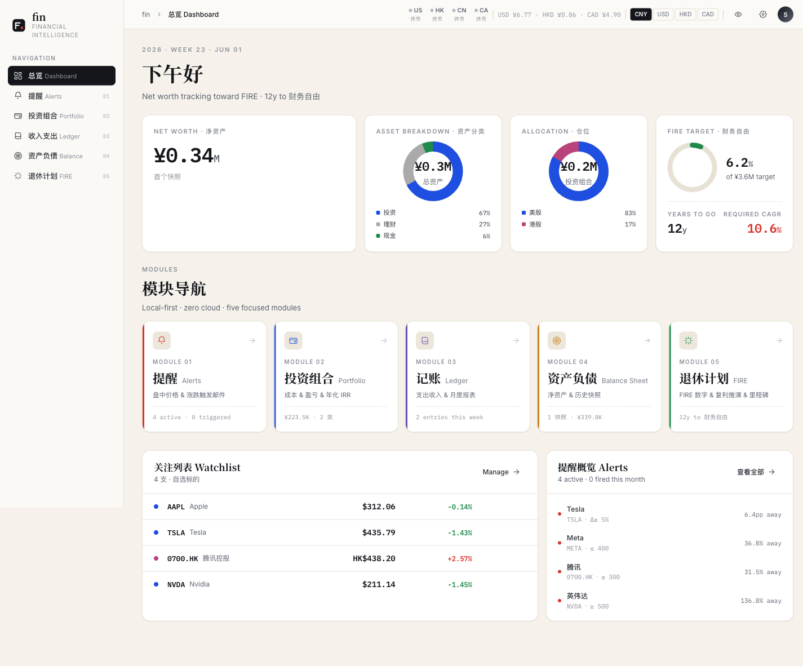
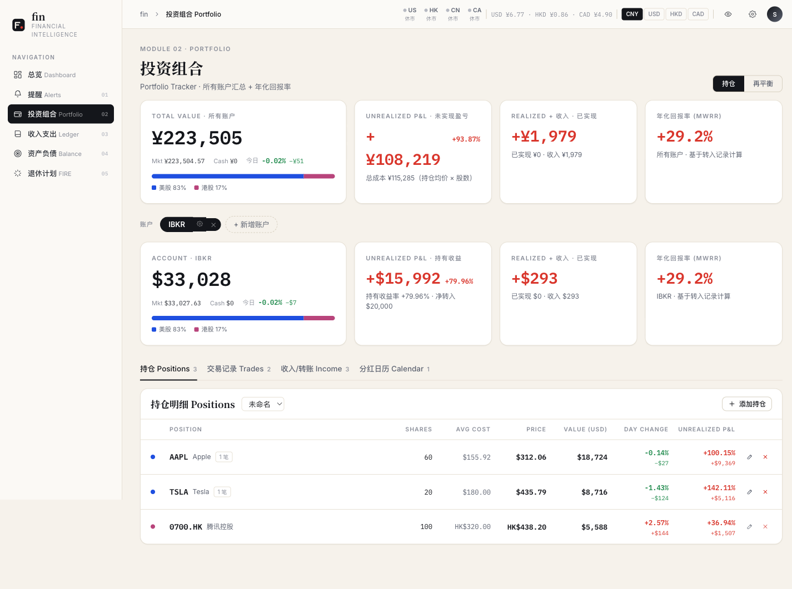
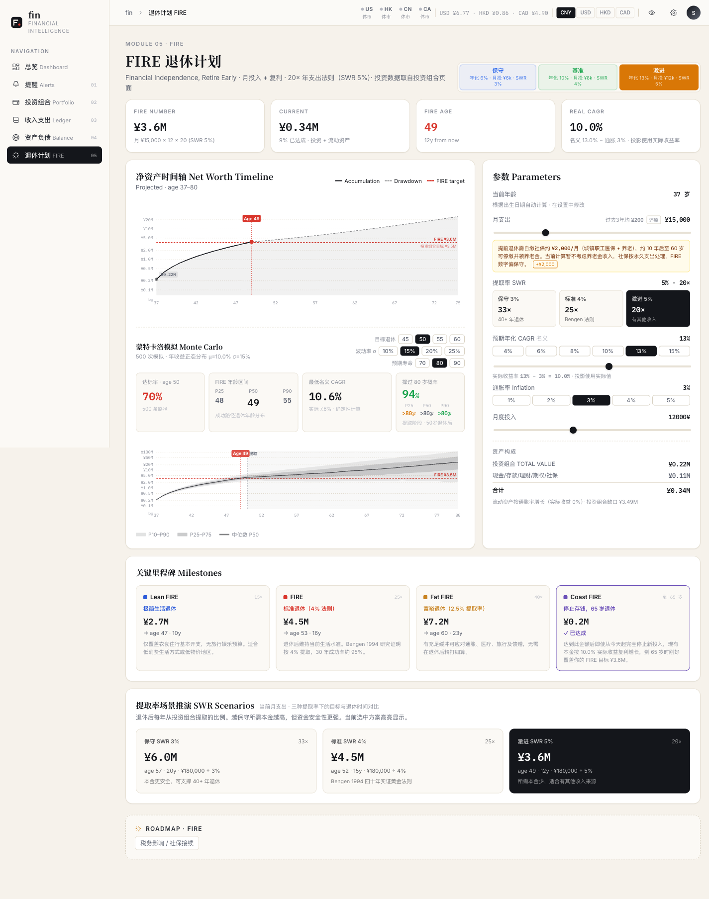

# fin

把个人财务当成一家公司来经营。通过三张财务报表追踪资金流向，回答一个核心问题：**什么时候可以达到 FIRE 退休目标？**

- **收入支出 (Income Statement)** — 工资 / 分红 / 利息 / 消费按类别分组，月度汇总。
- **资产负债 (Balance Sheet)** — 多账户、多币种快照管理，自动 FX 换算到净值。
- **现金流 (Cash Flow)** — 转入 / 转出 / 买入 / 卖出，组合成可对账的资金流动。

最终落到一个 FIRE 计算器：基于真实历史数据估算达到财务自由的时间点。

## Features

- **Dashboard** — 净值、汇率、市场快照、watchlist 行情
- **Alerts** — 美股 / 港股 / A 股 / 指数价格条件提醒（cron 每 20 分钟检查，触发后邮件通知）
- **Holdings** — 持仓 + 交易记录 + 分红 / 利息 / 转账，已实现 / 未实现盈亏
- **Ledger** — 收入支出记账，按类别月度汇总
- **Balance Sheet** — 账户层级（父/子）、快照对比、复制上一期快照
- **FIRE Calculator** — 蒙特卡洛模拟 + 确定性 CAGR 反推 + 通胀调整

## Screenshots

> 截图待补 — 路径已就位，把图放到 `assets/screenshots/` 即可。

| Dashboard | Holdings |
|---|---|
|  |  |

| Balance Sheet | FIRE |
|---|---|
|  |  |

## Quickstart

依赖 [`uv`](https://github.com/astral-sh/uv) 管理 Python 环境。前端无构建步骤（React + Babel standalone 走 CDN）。

```bash
git clone <repo-url>
cd fin
cp .env.example .env       # 填邮件相关变量，全空也能跑（仅跳过邮件发送）
uv sync                    # install Python deps
uv run python serve.py     # http://localhost:8899
```

### Server scripts

也可以用仓库根目录的脚本以后台方式管理服务，PID 写到 `fin.pid`，日志输出到 `logs/fin.log`：

```bash
./run.sh        # 启动（后台），等待端口 8899 绑定成功
./stop.sh       # 优雅停止（SIGTERM → 等待 → 必要时 SIGKILL）
./restart.sh    # 先 stop 后 run
```

### Cron — 价格提醒

价格提醒检查（可选，需要 cron）：

```cron
# crontab -e
*/20 * * * * cd /path/to/fin && /path/to/uv run python check_alerts.py
```

## Config

两层配置，泾渭分明：

- **启动期密钥** → `.env`（gitignored）
- **运行期偏好** → `data/settings.json`（gitignored，由前端「应用设置」弹窗维护）

### `.env`

| Variable | Purpose |
|---|---|
| `AGENTMAIL_API_KEY` | AgentMail API key — 用于发送提醒邮件。未设置则跳过邮件发送（提醒仍会触发并记入 DB）。 |
| `FIN_AGENTMAIL_INBOX` | 发件邮箱 id（如 `agent_xxx@agentmail.to`）。 |
| `FIN_LOG_DIR` | (Optional) 日志目录覆盖，默认 `<project>/logs`。 |

### `data/settings.json`

前端「应用设置」弹窗（TopBar 齿轮图标）管理：显示名（首页问候语）、通知邮箱、邮件开关、时区、出生日期（用于 FIRE 自动算年龄）、隐私脱敏开关、FIRE 默认参数。文件不存在时使用内置默认值。

## Stack

- **Backend** — Python 3.11+, FastAPI, SQLAlchemy, SQLite, yfinance, AgentMail
- **Frontend** — React 18 + Babel standalone（无构建步骤）
- **Data** — `data/fin.db`（SQLite，启动时自动建库）

## License

[MIT](LICENSE)
