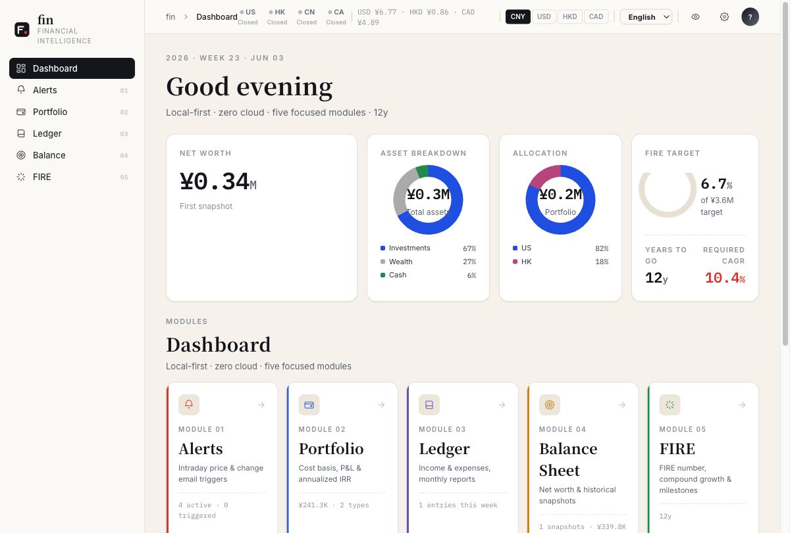
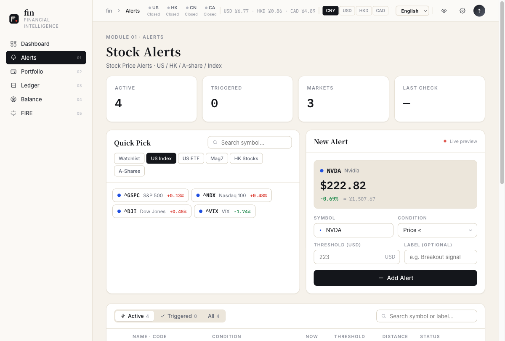
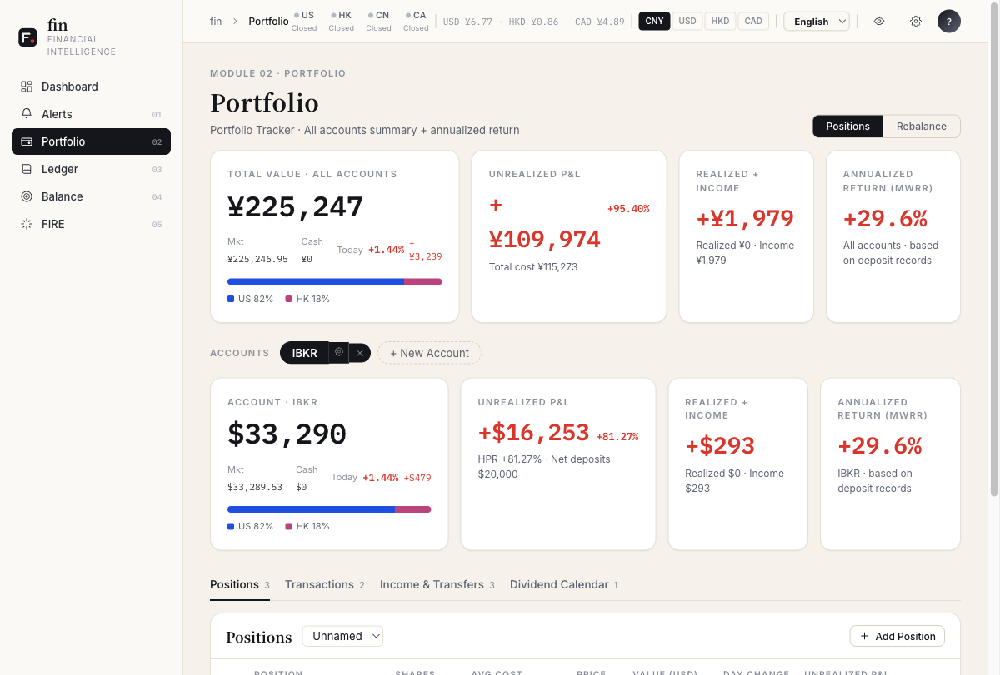
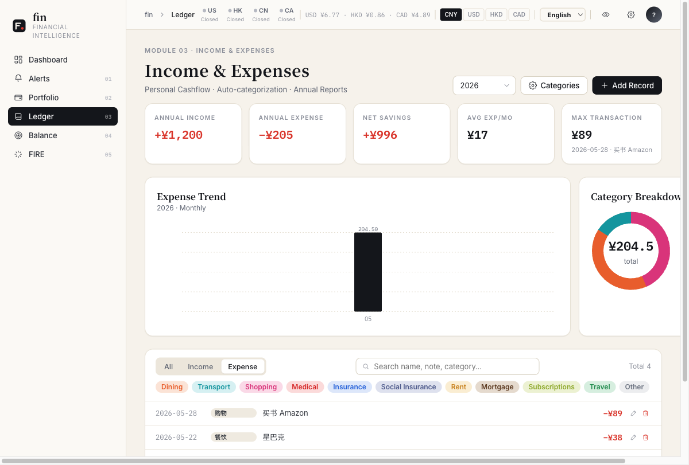
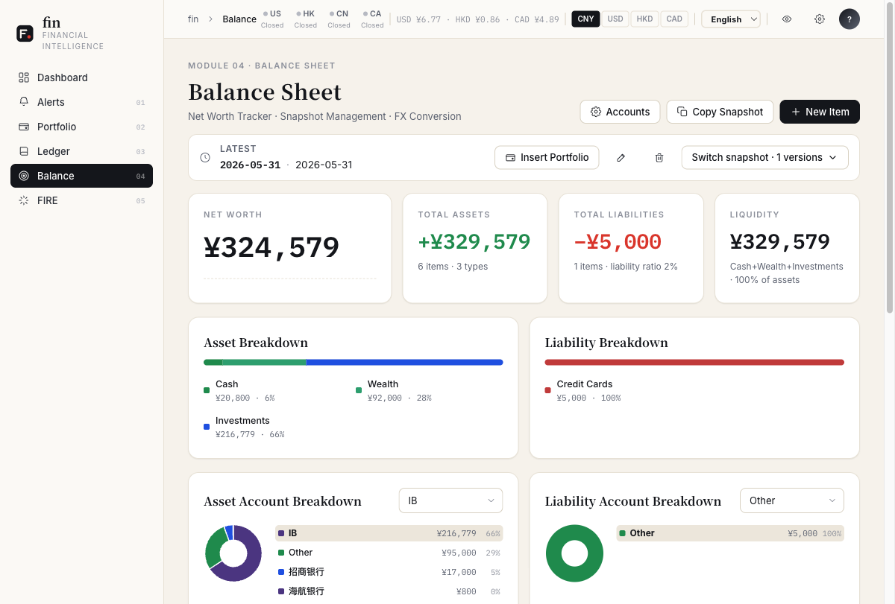
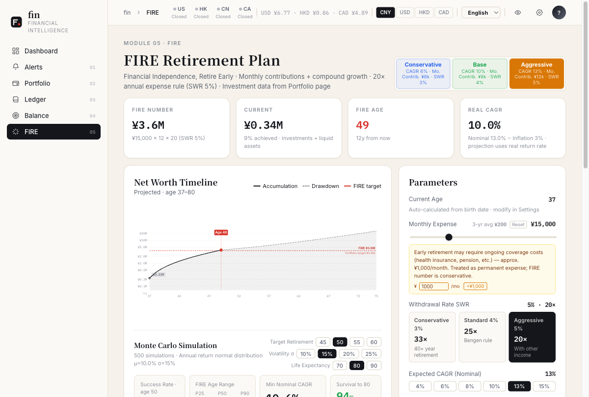

# fin

> 中文文档: [README.zh.md](README.zh.md)

Personal and family finance dashboard. Manage your household finances like a company — track money flows through three financial statements and answer one core question: **when can you reach FIRE?**

- **Income Statement** — Salary / dividends / interest / spending grouped by category, monthly summaries.
- **Balance Sheet** — Multi-account, multi-currency snapshot management with automatic FX conversion to net worth.
- **Cash Flow** — Deposits / withdrawals / buys / sells composed into a reconcilable cash flow.

Everything feeds into a FIRE calculator that estimates your financial independence date from real historical data.

## Screenshots

> All screenshots use demo data unrelated to any real account.

| Dashboard | Alerts |
|---|---|
|  |  |

| Holdings | Ledger |
|---|---|
|  |  |

| Balance Sheet | FIRE |
|---|---|
|  |  |

## Install (desktop app)

| Platform | Chip | Requirement | Version | Download |
|---|---|---|---|---|
| macOS | Apple Silicon (M1+) | macOS 11+ | v0.2.2 | [Download .dmg](https://github.com/xiapuyang/fin/releases/download/v0.2.2/Fin-v0.2.2-arm64.dmg) |
| Windows | x86\_64 | Windows 10+ | v0.2.2 | [Download .exe](https://github.com/xiapuyang/fin/releases/download/v0.2.2/Fin-Setup-v0.2.2.exe) |

### macOS

1. Download the `.dmg` (Apple Silicon only), open it, drag **Fin.app** to Applications.
2. Before first launch, run in Terminal:

```bash
xattr -d com.apple.quarantine /Applications/Fin.app
```

3. Double-click to launch. The Fin icon appears in the menu bar and a browser tab opens automatically.

### Windows

1. Download the `.exe` installer, run it, launch Fin from the Start menu.

---

## Why fin

**Consolidating all accounts into one view** is the core purpose. Most tools cover only one market or one function — stock tracking, or expense logging, or crypto. People with assets spread across US / HK / CN end up with N spreadsheets plus a manual summary. fin puts them into one database and one UI:

- **Cross-market portfolios** — CN stocks, HK stocks, US equities, ETFs, indices; watchlist with live quotes across all markets.
- **Multi-currency FX** — Positions, income, and net worth all stored in account-native currency; CNY / USD / HKD / CAD converted via yfinance live rates with fallback to stored rates on failure.
- **All account types** — Checking, savings, GIC, money market, credit card installments — all are just rows on the balance sheet, snapshotted and reconciled the same way.
- **True rate of return (XIRR)** — Cash-flow-weighted IRR solved via Newton-Raphson from deposit/withdrawal history + current market value. Per-account and aggregate MWRR, more honest than simple gain %.
- **Bulk import** — Load broker CSV exports, bank statements, position lists in one shot; with preview / dedup / confirmation gate; idempotent. Companion Claude Code skill (`skills/fin-import`) handles messy data via LLM.
- **Price alerts** — Price and change-% conditions on US / HK / CN / index symbols; cron checks every 20 minutes, triggers send email.

## Features

- **Dashboard** — Net worth, FX rates, market snapshot, watchlist quotes
- **Alerts** — Price / change conditions on any symbol (cron every 20 min, email on trigger)
- **Holdings** — Positions + trade history + dividends / interest / transfers; realized / unrealized P&L; **XIRR annualized return**
- **Ledger** — Income and expense tracking, category-based monthly summaries
- **Balance Sheet** — Account hierarchy (parent / child), multi-currency snapshots, copy-from-prior-period, automatic FX to unified net worth
- **FIRE Calculator** — Monte Carlo simulation + deterministic CAGR + inflation adjustment

## Email alerts

Price alerts can send email when triggered. Without configuration alerts still record to the DB — email is optional.

1. Sign up at [agentmail.to](https://agentmail.to), get an API Key and Inbox ID.
2. In the app **Settings**, enter the API Key, Inbox address, and **notification email**, then enable notifications.

## Claude Code Skills

For bulk data operations, two Claude Code skills are included in [`skills/`](skills/README.md):

- **fin-import** — bulk-import transactions, holdings, income, ledger entries, balance items, alerts, and watchlist symbols from CSV exports or pasted text. Handles messy real-world bank/broker data via LLM normalization.
- **fin-accounts** — batch create balance sheet accounts (parent + sub-accounts) from a description or the bundled template.

See [`skills/README.md`](skills/README.md) for install instructions.

---

## Development

### Prerequisites: install uv

Requires [`uv`](https://github.com/astral-sh/uv) for Python environment management:

```bash
# macOS / Linux
curl -LsSf https://astral.sh/uv/install.sh | sh
# or: brew install uv

# Windows (PowerShell)
powershell -ExecutionPolicy ByPass -c "irm https://astral.sh/uv/install.ps1 | iex"
```

### Start

```bash
git clone https://github.com/xiapuyang/fin
cd fin
uv sync
uv run python serve.py     # http://localhost:8888
```

Script mode (background, logs to `~/.fin/logs/fin.log`):

```bash
./run.sh      # start, wait for port bind, open browser
./stop.sh     # stop
./restart.sh  # restart
```

## Stack

| | |
|---|---|
| **Python** | 3.11+, managed by [uv](https://github.com/astral-sh/uv) |
| **Backend** | [FastAPI](https://github.com/fastapi/fastapi) · [uvicorn](https://github.com/encode/uvicorn) · [SQLAlchemy](https://github.com/sqlalchemy/sqlalchemy) · SQLite |
| **Data** | [yfinance](https://github.com/ranaroussi/yfinance) · [akshare](https://github.com/akfamily/akshare) · [exchange-calendars](https://github.com/gerrymanoim/exchange_calendars) · [AgentMail](https://agentmail.to) |
| **Frontend** | React 18 · Babel standalone (no build step; JSX transpiled in-browser at runtime) |
