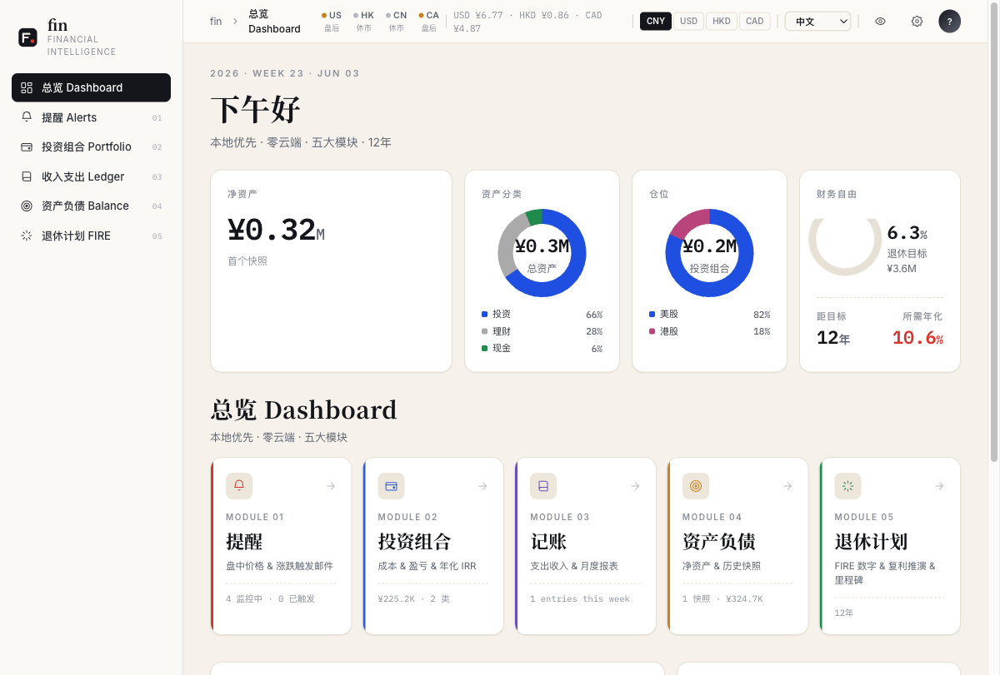
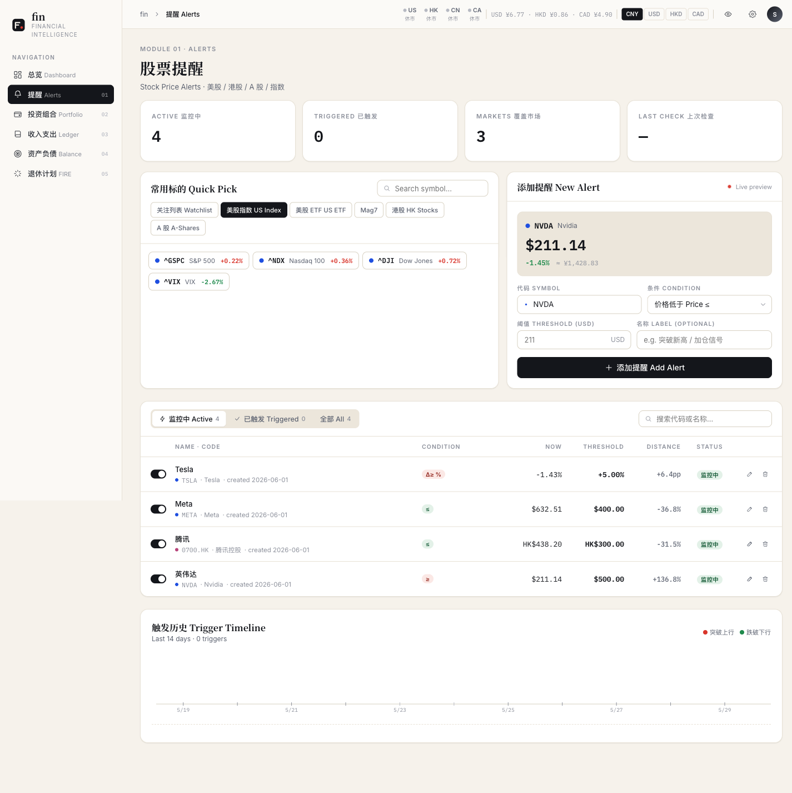
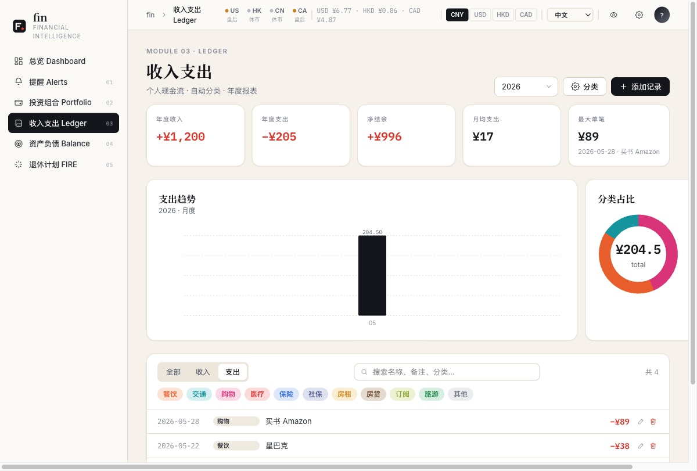
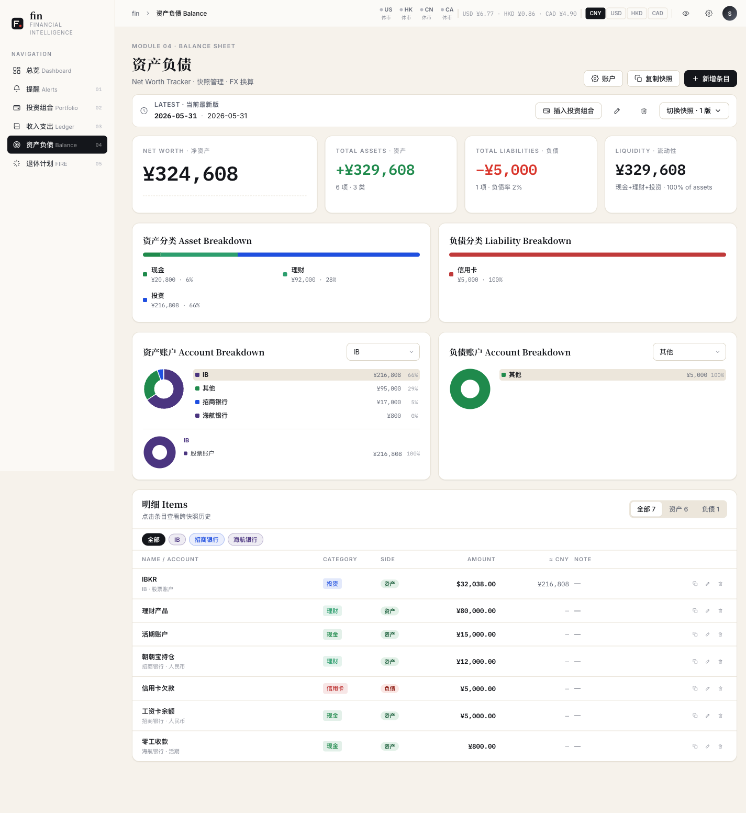
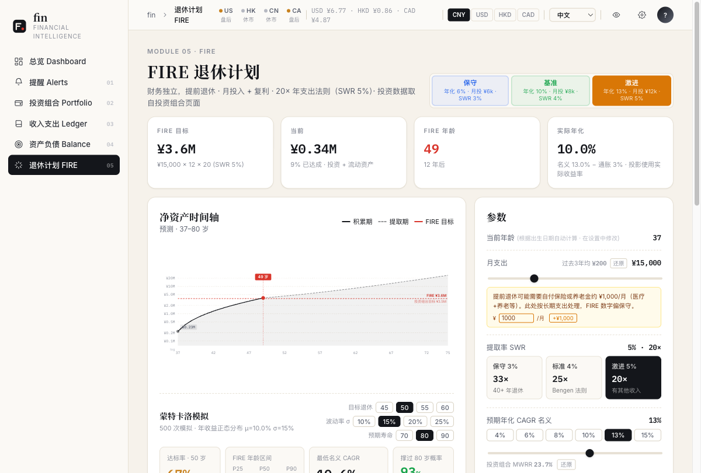

# fin

> English documentation: [README.md](README.md)

个人或家庭财务管理工具。把家庭财务当成一家公司来经营 —— 通过三张财务报表追踪资金流向，回答一个核心问题：**什么时候可以达到 FIRE 退休目标？**

- **收入支出 (Income Statement)** — 工资 / 分红 / 利息 / 消费按类别分组，月度汇总。
- **资产负债 (Balance Sheet)** — 多账户、多币种快照管理，自动 FX 换算到净值。
- **现金流 (Cash Flow)** — 转入 / 转出 / 买入 / 卖出，组合成可对账的资金流动。

最终落到一个 FIRE 计算器：基于真实历史数据估算达到财务自由的时间点。

## Screenshots

> 以下截图均为演示数据，与任何真实账户无关。

| 总览 Dashboard | 提醒 Alerts |
|---|---|
|  |  |

| 投资组合 Portfolio | 收入支出 Ledger |
|---|---|
|  |  |

| 资产负债 Balance | 退休计划 FIRE |
|---|---|
|  |  |

## 安装（桌面应用）

| 平台 | 芯片 | 系统要求 | 版本 | 下载 |
|------|------|----------|------|------|
| macOS | Apple Silicon (M1+) | macOS 11+ | v0.2.2 | [下载 .dmg](https://github.com/xiapuyang/fin/releases/download/v0.2.2/Fin-v0.2.2-arm64.dmg) |
| Windows | x86\_64 | Windows 10+ | v0.2.2 | [下载 .exe](https://github.com/xiapuyang/fin/releases/download/v0.2.2/Fin-Setup-v0.2.2.exe) |

### macOS

1. 下载 `.dmg`（仅支持 Apple Silicon），打开后将 **Fin.app** 拖入 Applications
2. 首次启动前在终端运行：

```bash
xattr -d com.apple.quarantine /Applications/Fin.app
```

3. 双击启动，菜单栏右上角出现 Fin 图标，浏览器自动打开

### Windows

1. 下载 `.exe` 安装程序，运行后从开始菜单启动 Fin

---

## 为什么用 fin

**把所有账户收敛到一张表**，是这个工具最核心的事情。市面上的工具要么只管港 A 股票，要么只管美股，要么只管记账 —— 资产分散在中港美三地的人最后只能开 N 个表 + 一个手动汇总 Excel。fin 把它们放进一个数据库一个 UI：

- **跨市场股票账户** — 中国 A 股、港股、美股、ETF、指数；自选股 watchlist 跨市场实时行情。
- **多币种实时换算** — 持仓 / 收支 / 净值都按账户原币种存储，CNY / USD / HKD / CAD 通过 yfinance 实时 FX 换算到统一币种汇总，汇率获取失败回退到常驻 fallback。
- **储蓄 / 理财 / 信用卡全覆盖** — 活期、定期、GIC、货币基金、现金管理、信用卡分期 —— 都是资产负债表上一个普通账户，统一快照、统一对账。
- **IRR 年化回报率** — 基于转入 / 转出现金流 + 当前持仓市值用 Newton-Raphson 解 XIRR，单账户和全账户都能算 MWRR，比"涨跌幅"更贴近真实回报率。
- **批量数据导入** — 一次性把券商导出的 CSV、银行流水、持仓列表灌进系统；带预览 / 去重 / 确认门，幂等可重跑。配套 Claude Code skill (`skills/fin-import`) 让 LLM 直接处理脏数据。
- **价格提醒** — 美股 / 港股 / A 股 / 指数的价格 + 涨跌幅条件提醒，cron 每 20 分钟检查，触发后发邮件。

## 功能 Features

- **总览 Dashboard** — 净值、汇率、市场快照、watchlist 行情
- **提醒 Alerts** — 美股 / 港股 / A 股 / 指数价格条件提醒（每 20 分钟检查，触发后邮件通知）
- **投资组合 Portfolio** — 持仓 + 交易记录 + 分红 / 利息 / 转账，已实现 / 未实现盈亏，**XIRR 年化回报率**
- **收入支出 Ledger** — 收入支出记账，按类别月度汇总
- **资产负债 Balance** — 账户层级（父/子）、多币种快照对比、复制上一期快照、自动 FX 换算到统一净值
- **退休计划 FIRE** — 蒙特卡洛模拟 + 确定性 CAGR 反推 + 通胀调整

---

## 开发

### 前置：安装 uv

依赖 [`uv`](https://github.com/astral-sh/uv) 管理 Python 环境：

```bash
# macOS / Linux
curl -LsSf https://astral.sh/uv/install.sh | sh
# or: brew install uv

# Windows (PowerShell)
powershell -ExecutionPolicy ByPass -c "irm https://astral.sh/uv/install.ps1 | iex"
```

### 启动

```bash
git clone https://github.com/xiapuyang/fin
cd fin
uv sync
uv run python serve.py     # http://localhost:8888
```

脚本方式（后台运行，日志写到 `~/.fin/logs/fin.log`）：

```bash
./run.sh      # 启动，等待端口绑定后自动打开浏览器
./stop.sh     # 停止
./restart.sh  # 重启
```

### 邮件提醒（可选）

价格提醒触发时可以发邮件。不配置也能正常使用，提醒照常记录到 DB，只是不发邮件。

1. 在 [agentmail.to](https://agentmail.to) 注册，获取 API Key 和 Inbox ID
2. 在应用**设置**中填写 API Key、Inbox 地址和**通知邮箱**，打开通知开关

## 技术栈

| | |
|---|---|
| **Python** | 3.11+，[uv](https://github.com/astral-sh/uv) 管理环境 |
| **后台** | [FastAPI](https://github.com/fastapi/fastapi) · [uvicorn](https://github.com/encode/uvicorn) · [SQLAlchemy](https://github.com/sqlalchemy/sqlalchemy) · SQLite |
| **数据源** | [yfinance](https://github.com/ranaroussi/yfinance) · [akshare](https://github.com/akfamily/akshare) · [exchange-calendars](https://github.com/gerrymanoim/exchange_calendars) · [AgentMail](https://agentmail.to) |
| **前端** | React 18 · Babel standalone（无构建步骤，JSX 在浏览器运行时转译） |
